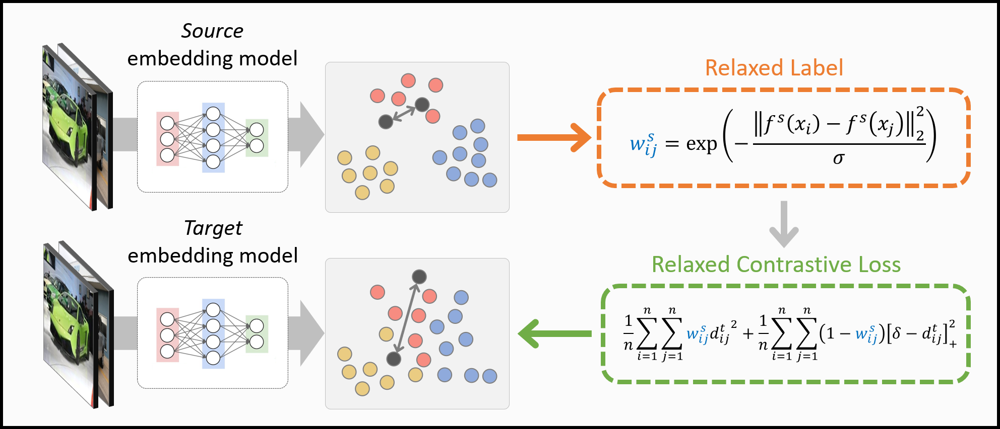
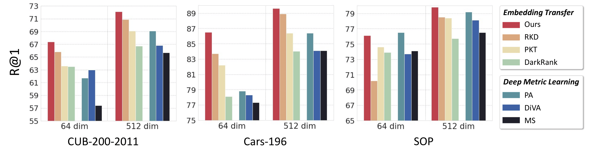

# Embedding Transfer with Label Relaxation for Improved Metric Learning

Official PyTorch implementation of CVPR 2021 paper [**Embedding Transfer with Label Relaxation for Improved Metric Learning**](https://arxiv.org/abs/2103.14908). 

Embedding trnasfer with **Relaxed Contrastive Loss** improves performance, or reduces sizes and output dimensions of embedding model effectively.

This repository provides source code of experiments on three datasets (CUB-200-2011, Cars-196 and Stanford Online Products) 
including **relaxed contrastive loss**, **relaxed MS loss**, and 6 other knowledge distillation or embedding transfer methods such as:
- *FitNet*, Fitnets: hints for thin deep nets
- *Attention*, Paying More Attention to Attention: Improving the Performance of Convolutional Neural Networks via Attention Transfer
- *CRD*, Contrastive Representation Distillation
- *DarkRank*, Darkrank: Accelerating Deep Metric Learning via Cross Sample Similarities Transfer
- *PKT*, Learning Deep Representations with Probabilistic Knowledge Transfer
- *RKD*, Relational Knowledge Distillation

## Overview

### Relaxed Contrastive Loss
- Relaxed contrastive loss exploits pairwise similarities between samples in the source embedding space as relaxed labels, 
  and transfers them through a contrastive loss used for learning target embedding models.
  
<p align="center"></p>

### Experimental Restuls
- Our method achieves the state of the art when embedding dimension is 512, and is as competitive as recent metric learning models 
  even with a substantially smaller embedding dimension. In all experiments, it is superior to other embedding transfer techniques. 

<p align="center"></p>

## Requirements

- Python3
- PyTorch (> 1.0)
- NumPy
- tqdm
- wandb
- [Pytorch-Metric-Learning](https://github.com/KevinMusgrave/pytorch-metric-learning)

## Getting Started

### Prepare Datasets

1. Download three public benchmarks for deep metric learning.
   - [CUB-200-2011](http://www.vision.caltech.edu/visipedia-data/CUB-200/images.tgz)
   - Cars-196 ([Img](http://imagenet.stanford.edu/internal/car196/car_ims.tgz), [Annotation](http://imagenet.stanford.edu/internal/car196/cars_annos.mat))
   - Stanford Online Products ([Link](https://cvgl.stanford.edu/projects/lifted_struct/))

2. Extract the tgz or zip file into `./data/` (Exceptionally, for Cars-196, put the files in a `./data/cars196`)

### Prepare Pretrained Source models
1. Download the pretrained source models.

```bash
sh scripts/download_pretrained_source_models.sh
```

### Training Target Embedding Network with Relaxed Contrastive Loss
#### 1. Self-transfer Setting

**Self-transfer**: Transfer to a model with the same architecture and embedding dimension for performance improvement. 

Transfer the knowledge of source embedding network (Inception-BN, 512 dim) to target embedding network (Inception-BN, 512 dim) using **Relaxed Contrastive Loss**.

- CUB-200-2011

```bash
python code/train_target.py --gpu-id 0 --loss Relaxed_Contra --model bn_inception \
--embedding-size 512 --batch-size 90 --IPC 3 --dataset cub --epochs 90 \
--source-ckpt ./pretrained_source/bn_inception/cub_bn_inception_512dim_Proxy_Anchor_ckpt.pth \
--view 2 --sigma 1 --save 1
```

- Cars-196

```bash
python code/train_target.py --gpu-id 0 --loss Relaxed_Contra --model bn_inception \ 
--embedding-size 512 --batch-size 90 --IPC 3 --dataset cars --epochs 90 \
--source-ckpt ./pretrained_source/bn_inception/cars_bn_inception_512dim_Proxy_Anchor_ckpt.pth \
--view 2 --sigma 1 --save 1
```

- SOP

```bash
python code/train_target.py --gpu-id 0 --loss Relaxed_Contra --model bn_inception \
--embedding-size 512 --batch-size 90 --IPC 3 --dataset SOP --epochs 150 \
--source-ckpt ./pretrained_source/bn_inception/SOP_bn_inception_512dim_Proxy_Anchor_ckpt.pth \
--view 2 --sigma 1 --save 1
```

|  |  |  | **CUB** |    |  | **Cars** |  |  | **SOP** |  |
|:-:|:-:|:-:|:-:|:-:|:-:|:-:|:-:|:-:|:-:|:-:|
| Method | Backbone | R@1 | R@2 | R@4 | R@1 | R@2 | R@4 | R@1 | R@2 | R@4 |
| *Source*: PA | BN<sup>512</sup> | 69.1 | 78.9 | 86.1 | 86.4 | 91.9 | 95.0 |79.2  |90.7  |96.2  |
|FitNet |BN<sup>512</sup>| 69.9 |79.5 |86.2| 87.6| 92.2 |95.6| 78.7 |90.4 |96.1|
|Attention | BN<sup>512</sup> |66.3| 76.2 |84.5| 84.7| 90.6| 94.2| 78.2 |90.4| 96.2|
|CRD | BN<sup>512</sup> |67.7 |78.1 |85.7 |85.3 |91.1 |94.8 |78.1 |90.2 |95.8|
|DarkRank | BN<sup>512</sup> | 66.7 |76.5 |84.8 |84.0 |90.0 |93.8 |75.7 |88.3 |95.3|
|PKT | BN<sup>512</sup> |69.1 |78.8 |86.4 |86.4 |91.6|94.9| 78.4| 90.2 |96.0|
|RKD | BN<sup>512</sup> |70.9 |80.8| 87.5 |88.9 |93.5| 96.4| 78.5| 90.2| 96.0|
|**Ours** | BN<sup>512</sup> | **72.1**  | **81.3** | **87.6** | **89.6** | **94.0** | **96.5** | **79.8** | **91.1** | **96.3** |


#### 2. Dimensionality Reduction Setting

**Dimensionality reduction**: Transfer to the same architecture with a lower embedding dimension for efficient image retrieval. 

Transfer the knowledge of source embedding network (Inception-BN, 512 dim) to target embedding network (Inception-BN, 64 dim) using **Relaxed Contrastive Loss**.

- CUB-200-2011

```bash
python code/train_target.py --gpu-id 0 --loss Relaxed_Contra --model bn_inception \
--embedding-size 64 --batch-size 90 --IPC 3 --dataset cub --epochs 90 \
--source-ckpt ./pretrained_source/bn_inception/cub_bn_inception_512dim_Proxy_Anchor_ckpt.pth \
--view 2 --sigma 1 --save 1
```

- Cars-196

```bash
python code/train_target.py --gpu-id 0 --loss Relaxed_Contra --model bn_inception \
--embedding-size 64 --batch-size 90 --IPC 3 --dataset cars --epochs 90 \
--source-ckpt ./pretrained_source/bn_inception/cars_bn_inception_512dim_Proxy_Anchor_ckpt.pth \
--view 2 --sigma 1 --save 1
```

- SOP

```bash
python code/train_target.py --gpu-id 0 --loss Relaxed_Contra --model bn_inception \
--embedding-size 64 --batch-size 90 --IPC 3 --dataset SOP --epochs 150 \
--source-ckpt ./pretrained_source/bn_inception/SOP_bn_inception_512dim_Proxy_Anchor_ckpt.pth \
--view 2 --sigma 1 --save 1
```

|  |  |  | **CUB** |    |  | **Cars** |  |  | **SOP** |  |
|-|:-:|:-:|:-:|:-:|:-:|:-:|:-:|:-:|:-:|:-:|
| Method | Backbone | R@1 | R@2 | R@4 | R@1 | R@2 | R@4 | R@1 | R@2 | R@4 |
| *Source*: PA | BN<sup>512</sup> | 69.1 | 78.9 | 86.1 | 86.4 | 91.9 | 95.0 |79.2  |90.7  |96.2  |
|FitNet| BN<sup>64</sup>| 62.3| 73.8| 83.0 |81.2| 87.7 |92.5 |**76.6**| **89.3**|**95.4**|
|Attention| BN<sup>64</sup>| 58.3| 69.4 |79.1| 79.2 |86.7| 91.8 |76.3 |89.2 |95.4|
|CRD| BN<sup>64</sup>| 60.9 |72.7| 81.7| 79.2 |87.2| 92.1 |75.5 |88.3 |95.3|
|DarkRank| BN<sup>64</sup>| 63.5| 74.3 |83.1| 78.1| 85.9| 91.1 |73.9| 87.5 |94.8|
|PKT| BN<sup>64</sup>| 63.6 |75.8| 84.0 |82.2 |88.7| 93.5| 74.6 |87.3 |94.2|
|RKD| BN<sup>64</sup>| 65.8 |76.7 |85.0 |83.7 |89.9 |94.1 |70.2 |83.8 |92.1|
|**Ours**| BN<sup>64</sup>| **67.4** |**78.0**| **85.9**| **86.5** |**92.3**|**95.3**| 76.3 |88.6 |94.8|

#### 3. Model compression Setting

**Model compression**: Transfer to a smaller network with a lower embedding dimension for usage in low-power and resource limited devices 

Transfer the knowledge of source embedding network (ResNet50, 512 dim) to target embedding network (ResNet18, 128 dim) using **Relaxed Contrastive Loss**.

- CUB-200-2011

```bash
python code/train_target.py --gpu-id 0 --loss Relaxed_Contra --model resnet18 \
--embedding-size 128 --batch-size 90 --IPC 3 --dataset cub --epochs 90 \
--source-ckpt ./pretrained_source/resnet50/cub_resnet50_512dim_Proxy_Anchor_ckpt.pth \
--view 2 --sigma 1 --save 1
```

- Cars-196

```bash
python code/train_target.py --gpu-id 0 --loss Relaxed_Contra --model resnet18 \
--embedding-size 128 --batch-size 90 --IPC 3 --dataset cars --epochs 90 \
--source-ckpt ./pretrained_source/resnet50/cars_resnet50_512dim_Proxy_Anchor_ckpt.pth \
--view 2 --sigma 1 --save 1
```

- SOP

```bash
python code/train_target.py --gpu-id 0 --loss Relaxed_Contra --model resnet18 \
--embedding-size 128 --batch-size 90 --IPC 3 --dataset SOP --epochs 150 \
--source-ckpt ./pretrained_source/resnet50/SOP_resnet50_512dim_Proxy_Anchor_ckpt.pth \
--view 2 --sigma 1 --save 1
```

|  |  |  | **CUB** |    |  | **Cars** |  |  | **SOP** |  |
|-|:-:|:-:|:-:|:-:|:-:|:-:|:-:|:-:|:-:|:-:|
| Method | Backbone | R@1 | R@2 | R@4 | R@1 | R@2 | R@4 | R@1 | R@2 | R@4 |
| *Source*: PA | R50<sup>512</sup> |69.9 |79.6 |88.6| 87.7| 92.7| 95.5 |80.5| 91.8| 98.8|
|FitNet | R18<sup>128</sup>| 61.0 |72.2 |81.1 |78.5 |86.0| 91.4| 76.7| 89.4| 95.5|
|Attention| R18<sup>128</sup>| 61.0| 71.7 |81.5 |78.6 |85.9| 91.0 |76.4 |89.3 |95.5|
|CRD | R18<sup>128</sup>| 62.8| 73.8 |83.2 |80.6 |87.9 |92.5| 76.2| 88.9 |95.3|
|DarkRank | R18<sup>128</sup>| 61.2| 72.5 |82.0 |75.3| 83.6| 89.4| 72.7 |86.7 |94.5|
|PKT | R18<sup>128</sup>| 65.0 |75.6 |84.8| 81.6| 88.8| 93.4 |76.9| 89.2| 95.5|
|RKD | R18<sup>128</sup>| 65.8| 76.3 |84.8 |84.2 |90.4| 94.3 |75.7 |88.4 |95.1|
|**Ours** |R18<sup>128</sup> |**66.6** |**78.1**| **85.9**|**86.0**| **91.6**| **95.3** |**78.4**| **90.4** |**96.1**|


### Evaluating Image Retrieval

Follow the below steps to evaluate the trained model. 

Trained best model will be saved in the `./logs/folder_name`.

```bash
# The parameters should be changed according to the model to be evaluated.
python evaluate.py --gpu-id 0 \
                   --batch-size 120 \
                   --model bn_inception \
                   --embedding-size 512 \
                   --dataset cub \
                   --ckpt /set/your/model/path/best_model.pth
```

## Acknowledgements

Our code is modified and adapted on these great repositories:

- [Proxy Anchor Loss for Deep Metric Learning](https://github.com/tjddus9597/Proxy-Anchor-CVPR2020)
- [No Fuss Distance Metric Learning using Proxies](https://github.com/dichotomies/proxy-nca)
- [PyTorch Metric learning](https://github.com/KevinMusgrave/pytorch-metric-learning)


## Citation

If you use this method or this code in your research, please cite as:

    @inproceedings{kim2021embedding,
      title={Embedding Transfer with Label Relaxation for Improved Metric Learning},
      author={Kim, Sungyeon and Kim, Dongwon and Cho, Minsu and Kwak, Suha},
      booktitle={Proceedings of the IEEE Conference on Computer Vision and Pattern Recognition},
      year={2021}
    }

